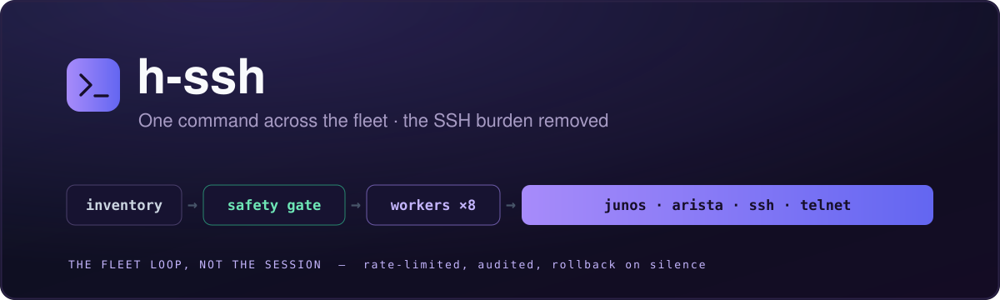

<div align="center">



<br/>

[](#-quick-start)


**h-ssh is the fleet loop, not the session. Point it at one device or three hundred — Juniper, Arista, any SSH box, kit still on a telnet console — and get the output back, in parallel, with the connection handling gone.**

The per-device session is a solved problem; what nobody hands you is everything *around* it. The thread pool. Collecting results per device. Making sure one dead box doesn't sink the run. A rate limiter so you don't hammer a router you've already failed against. A record of what you changed. That's the part you'd otherwise rewrite in every script, and it's what this is.

Reads go over plain SSH because they're cheap; config writes go over NETCONF because they need a lock, a diff, and a rollback. Every edit passes a safety gate, prompts before it commits, and lands in a JSONL audit trail — and `--commit-confirmed` puts the device back the way it was if you never confirm.

[Quick start](#-quick-start) · [Modes](#️-modes) · [Transports](#-transports) · [Safety](#-safety) · [Library use](#-library-usage) · [Test results](TESTS.md)

</div>

---

## ✨ What it is

- **🔌 Four transports, one interface.** Juniper (SSH for show, NETCONF for config), Arista (eAPI), any generic SSH device, and raw-socket telnet — including IOS- and Junos-flavoured prompt handling. Same flags whichever you point it at.
- **⚡ Parallel by default.** Devices are worked concurrently behind an `asyncio` semaphore, `--workers 8` out of the box. 3 routers, 3 show commands, ~350 ms end to end.
- **🎯 One command or many, one device or many.** `--batch` runs several commands per device on a single connection; `--job` takes a JSON file with different commands — and different modes — per device, readable from a file or stdin.
- **🛡️ Writes are gated.** Pre-flight reachability check, `y/N` confirmation, `--dry-run` that shows the diff without committing, per-device rate limit and cooldown, and `--commit-confirmed N` for changes that undo themselves if you lose the session.
- **📋 Templates instead of memorised syntax.** `-sC bgp` resolves through a per-vendor JSON template library; drop your own in `~/.h-ssh/commands/{vendor}.json` to override.
- **🤖 Built to be scripted.** `--json` on stdout, a structured summary line on stderr, meaningful exit codes, and credentials from `HSSH_USER` / `HSSH_PASSWORD` — or import `hssh` and skip the CLI entirely.
- **🪶 One runtime dependency.** `paramiko`. Vendor libraries are optional extras, and telnet is a raw socket — no stdlib `telnetlib`, so it still works on Python 3.13+.

## ⚙️ How it works

```
  devices.csv / --target / --job              per device, up to --workers at once
  ──────────────────────────────────           ─────────────────────────────────────
                    │                          ┌─ junos    show → paramiko SSH
                    ▼                          │           edit → PyEZ NETCONF
        ┌───────────────────────┐              │                  lock → load → diff
        │ safety gate           │              │                  → commit → unlock
        │ rate limit 10/device  │──▶ workers ──┤
        │ cooldown 120s on fail │              ├─ arista   eAPI over HTTPS
        │ flock'd, cross-process│              ├─ ssh      exec_command
        └───────────────────────┘              └─ telnet   raw TCP + prompt match
                    │                                          │
                    └──────────── every edit ──────────────────┴──▶ audit.jsonl
```

Show commands take the cheap path — a paramiko session with `| no-more` appended — because a read doesn't need a config database. Config changes take the expensive one: PyEZ locks the candidate, loads, diffs, runs `commit_check`, commits, and unlocks, rolling back if any step fails.

## 📦 Install

```bash
git clone …/h-ssh.git && cd h-ssh
python3 -m venv .venv && . .venv/bin/activate

pip install -e .                  # core (paramiko) — SSH + telnet
pip install -e '.[junos]'         # + junos-eznc (NETCONF config)
pip install -e '.[arista]'        # + pyeapi
pip install -e '.[all]'           # + both
pip install -e '.[dev]'           # + pytest, both vendor libs
```

Requires Python 3.10+. Installs an `h-ssh` entry point; the repo's `./h-ssh.py` works uninstalled too.

## 🚀 Quick start

```bash
# show command across two routers, inline targets
./h-ssh.py --user admin -sC bgp --target R1:10.0.1.1:junos --target R2:10.0.1.2:junos

# ... or from a CSV inventory, as JSON
./h-ssh.py --user admin --json -sC "show version" --devices devices.csv

# compare one command's output across the fleet
./h-ssh.py --user admin -sC bgp --diff --target R1:10.0.1.1:junos --target R2:10.0.1.2:junos

# config change — look before you leap
./h-ssh.py --user admin -eC "set system ntp server 10.0.0.1" --dry-run
./h-ssh.py --user admin -eC "set system ntp server 10.0.0.1" -y

# a change that rolls itself back in 10 minutes unless you confirm
./h-ssh.py --user admin -eB configs/all.set --commit-confirmed 10 -y

# several commands per device, one connection
./h-ssh.py --user admin --batch commands.txt --target R1:10.0.1.1:junos

# a console server still speaking telnet
./h-ssh.py --user admin -sC "show version" --target SW1:10.0.0.1:5000:telnet-ios
```

Targets are `NAME:HOST:VENDOR` or `NAME:HOST:PORT:VENDOR`. A CSV inventory accepts `name,ip`, `name,ip,vendor`, headers or none, and `#` comments.

### Authentication

```bash
./h-ssh.py --user admin -sC bgp                     # SSH agent / key, no password
./h-ssh.py --user admin --password secret -sC bgp   # explicit
export HSSH_USER=admin HSSH_PASSWORD=secret         # or from the environment
```

## 🎛️ Modes

| Flag | Mode | What it does |
|---|---|---|
| `-sC` | Show | Run a show/display command (or a template name) |
| `-eC` | Edit command | Apply one config line to every target |
| `-eD` | Edit directory | Per-device config from `<NAME>.set` files |
| `-eB` | Edit broadcast | One config file applied to all targets |
| `--batch` | Batch | Several show commands from a file, one connection per device |
| `--job` | Job | Per-device commands *and* modes from JSON — file or `-` for stdin |

```json
[
  {"target": "R1:10.0.1.1:junos", "show": "show bgp summary"},
  {"target": "R2:10.0.1.2:junos", "show": "show version"},
  {"target": "R3:10.0.1.3:junos", "edit": "set system host-name R3-new"}
]
```

```bash
./h-ssh.py --user admin --job jobs.json --json
cat jobs.json | ./h-ssh.py --user admin --job - --json
```

## 🔌 Transports

| Vendor | Transport | Library | Show | Edit |
|---|---|---|---|---|
| `junos` | SSH + NETCONF | paramiko + junos-eznc | paramiko `exec_command` | PyEZ lock/load/diff/commit |
| `arista` | eAPI (HTTPS) | pyeapi | eAPI enable | eAPI config |
| `ssh` | SSH | paramiko | `exec_command` | `exec_command` |
| `telnet` | Raw socket | built-in | raw TCP | config mode |
| `telnet-ios` | Raw socket, IOS prompts | built-in | raw TCP | `configure terminal` |
| `telnet-junos` | Raw socket, Junos prompts | built-in | raw TCP | `configure` / `commit` |

Every transport reuses a single connection per device for batch work.

## 🔒 Safety

Layered, and every layer is off the critical path until you ask for a write.

| Guard | Flag | Behaviour |
|---|---|---|
| Pre-flight check | *(automatic)* | Edits verify reachability before touching config |
| Confirmation | *(automatic)* | Edits prompt `y/N`; `-y` to skip in automation |
| Dry run | `--dry-run` | Loads and diffs the candidate, never commits |
| Commit confirmed | `--commit-confirmed N` | Junos rolls back after N minutes unless confirmed |
| Safety gate | `--safety-file PATH` | 10 attempts per device per run; 120 s cooldown after a failure, held in a `flock`'d JSON file so it survives across processes |
| Audit trail | `--audit-log PATH` | Every edit appended as JSONL |

The gate is deliberately fail-closed: a device is marked active *before* the attempt, so a crash mid-run leaves it blocked rather than open.

Exit codes: `0` success · `1` a device failed · `2` usage error. Every run also prints a structured summary to stderr:

```
[h-ssh] {"targets":3,"ok":2,"fail":1,...}
```

## 🧩 Library usage

```python
from hssh import Target, vendors
from hssh.runner import run_for_target

# straight at a vendor
output = vendors.junos.show("10.0.1.1", "admin", None, "show version", 30, 20)

# or through the runner, with the safety gate in place
target = Target(name="R1", host="10.0.1.1", vendor="junos")
name, ok, output, ms = run_for_target(
    t=target, transport="junos", mode="show",
    show_cmd="show version", edit_cmd=None,
    config_dir=None, broadcast_file=None,
    user="admin", passwd=None,
    session_timeout=30, command_timeout=20,
    dry_run=False, commit_confirmed=None, save_dir=None,
)
```

Connection and command timeouts are separate knobs — a slow login and a slow `show route extensive` are different problems.

## 📁 Package structure

```
h-ssh/
├── hssh/
│   ├── core.py          # Target, CSV loader, template resolver, job parser
│   ├── cli.py           # argument parsing + orchestration
│   ├── runner.py        # concurrent execution engine
│   ├── safety.py        # SafetyGate — rate limit + cross-process cooldown
│   ├── audit.py         # JSONL audit trail
│   └── vendors/
│       ├── junos.py     # paramiko show + PyEZ NETCONF config
│       ├── arista.py    # eAPI
│       ├── generic.py   # paramiko SSH
│       └── telnet.py    # raw socket, per-flavour prompt handling
├── commands/            # per-vendor template library (JSON)
├── tests/
├── h-ssh.py             # CLI entry point
└── devices.csv          # example inventory
```

## 🧪 Tests

37 unit tests, plus 59 live integration tests run against three Junos vMX routers on 24.2R1-S2.5 — covering every mode, both edit paths, concurrency, error handling, exit codes, and the safety gate. Full breakdown in [TESTS.md](TESTS.md).

```bash
pip install -e '.[dev]'
pytest
```

## 🔗 See also

- [`h-network/junos-mcp-server`](https://github.com/h-network/junos-mcp-server) — the same device access exposed to an LLM over MCP
- [`h-network/h-cli`](https://github.com/h-network/h-cli) — AI-driven infrastructure management this feeds into

## 📄 License

MIT — see [LICENSE](LICENSE).
